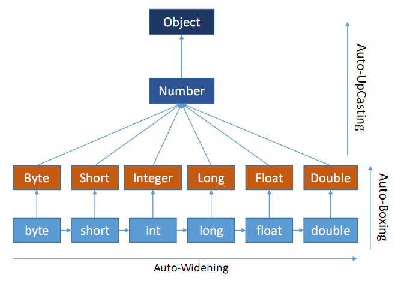

This is an quite interesting topic in Java. Before I wrote this reading note I can not exactly distinguish them one from another. So let's see what auto-widening, auto-boxing and auto-upcasting mean, and under what circumstances they will happen.

<!--more-->

# The Size Of Primitive Types

The table below shows the sizes of each primitive types in Java:

| primitive types | byte | short | int  | long | float | double |
| :-------------: | :--: | :---: | :--: | :--: | :---: | :----: |
|   size (byte)   |  1   |   2   |  4   |  8   |   4   |   8    |

Please note that although the size of **float** (4 bytes) is little than that of **long** (8 bytes), the number range of **float** is still larger than **long** due to their different data structures. Thus from long to float, the auto-widening is possible.

# Code Examples

Let's go through the examples below.

```java
public class WrapperClasses {
    static void overloadedMethod(Integer I) {
        System.out.println("Integer Wrapper Class Type");
    }
    static void overloadedMethod(long l) {
        System.out.println("long primitive type");
    }
    public static void main(String[] args) {
        int i = 21;
        overloadedMethod(i);  // output: long primitive type
    }
}
```

In this example, one method takes Integer wrapper class type as an argument and another method takes primitive long type as an argument. In the main method, we are calling overloadedMethod by passing primitive int type as an argument. When you run this program, you will get “long primitive type” as output. That means, **auto-widening is happening** not auto-boxing.

Now, make a little modification to the above example. Change the argument of the second method from primitive long type to Long wrapper class type.

```java
public class WrapperClasses {
    static void overloadedMethod(Integer I) {
        System.out.println("Integer Wrapper Class Type");
    }
    static void overloadedMethod(Long L) {
        System.out.println("Long Wrapper Class Type");
    }
    public static void main(String[] args) {
        int i = 21;
        overloadedMethod(i);  // output: Integer Wrapper Class Type
    }
}
```

Now run this program. you will get “Integer Wrapper Class Type” as output. That means **auto-boxing is happening**.

Now, make one more modification to the above program. Change the argument of first method from Integer Wrapper Class Type to Double Wrapper Class Type.

```java
public class WrapperClasses {
    static void overloadedMethod(Double D) {
        System.out.println("Double Wrapper Class Type");
    }
    static void overloadedMethod(Long L) {
        System.out.println("Long Wrapper Class Type");
    }
    public static void main(String[] args) {
        int i = 21;
        overloadedMethod(i);  // output: compile time error
    }
}
```

Above example gives compile time error. Because, there is no method definition which takes int type as an argument. Primitive int type can be auto-widened to big sized primitive types or can be auto-boxed to Integer wrapper class type but can not be converted into Double or Long wrapper class type.

Now, add one more overloadedMethod which takes **Number** Class type as an argument to the above class.

```java
public class WrapperClasses {
    static void overloadedMethod(Double D) {
        System.out.println("Double Wrapper Class Type");
    }
    static void overloadedMethod(Long L) {
        System.out.println("Long Wrapper Class Type");
    }
    static void overloadedMethod(Number N) {
        System.out.println("Number Class Type");
    }
    public static void main(String[] args) {
        int i = 21;
        overloadedMethod(i);  // output: Number Class Type
    }
}
```

Now run this program, you will get “Number Class Type” as output. What happened here is, internally primitive int type is auto-boxed to Integer type and Integer type is auto-UpCasted to Number type as Integer wrapper class is a sub class of Number class.

# Summary

The mechanism can be summarized as below:



1. If you are passing primitive data type as an argument to the method call, compiler first checks for a method definition which takes **same data type** as an argument.
2. If such method does not exist, then it checks for the method definition which takes big sized primitive data type than passed data type. i.e It tries to perform **auto-widening conversion** of passed data type.
3. If auto-widening conversion is not possible, then it checks for method definition which takes corresponding wrapper class type as an argument. i.e It tries to perform **auto-boxing conversion**.
4. If such method does not exist, then it checks for the method which takes super class type (Number or Object type) as an argument. That means the **auto-upcasting** is happening.
5. If such method also does not exist, then compiler gives compile time error.


# References

[1] Auto-Widening Vs Auto-Boxing Vs Auto-UpCasting: [http://javaconceptoftheday.com/auto-widening-auto-boxing-auto-upcasting-java](http://javaconceptoftheday.com/auto-widening-auto-boxing-auto-upcasting-java)

[2] How does upcasting works in Java: [https://stackoverflow.com/questions/45456524/how-does-upcasting-works-in-java](https://stackoverflow.com/questions/45456524/how-does-upcasting-works-in-java)

[3] Wrapper class in Java: [http://javainsimpleway.com/wrapper-class-in-java](http://javainsimpleway.com/wrapper-class-in-java)

[4] Autoboxing and Unboxing: [https://docs.oracle.com/javase/tutorial/java/data/autoboxing.html](https://docs.oracle.com/javase/tutorial/java/data/autoboxing.html)

[5] 为什么long类型的比float类型的范围小: [https://blog.csdn.net/shanshan1yi/article/details/48477119](https://blog.csdn.net/shanshan1yi/article/details/48477119)


